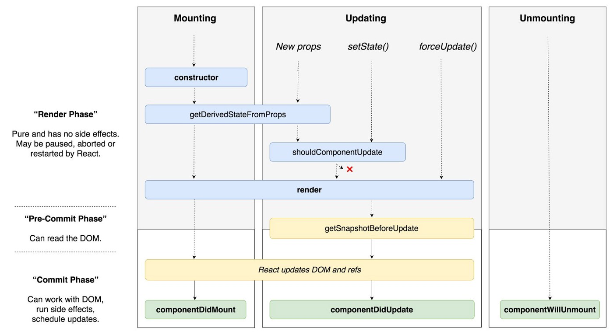
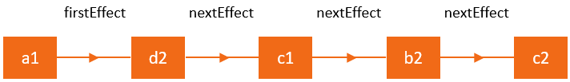
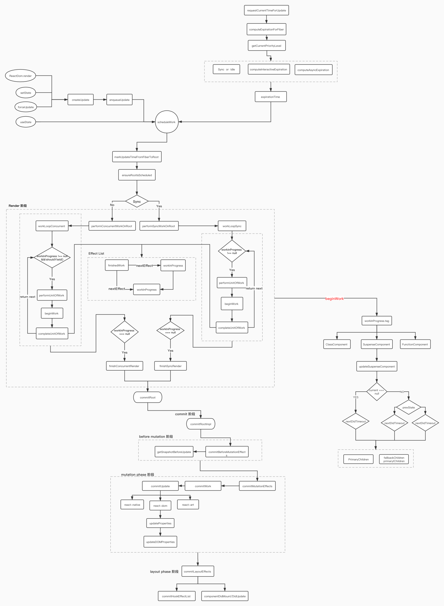

可调试 react 源码，目前 react 的版本是 16.9.0。
可在 src/react/packages/\* 目录下找到想要跟踪的代码，debugger 或 console 皆可。

流程：

1. npm install
2. npm start

---

# React Fiber

在 React v16.13 版本中，正式推出了实验性的 Concurrent Mode，尤其是提供一种新的机制 Suspense，非常自然地解决了一直以来存在的异步副作用问题。
结合前面 v16.8 推出的 Hooks，
v16.0 底层架构 Fiber，
React 给开发者体验上带来了极大提升以及一定程度上更佳的用户体验。

## Stack Reconciler 和 Fiber Reconciler

Stack Reconciler 是 React v15 及之前版本使用的协调算法。而 React Fiber 则是从 v16 版本开始对 Stack Reconciler 进行的重写，是 v16 版本的核心算法实现。
Stack Reconciler 的实现使用了**同步递归模型**，该模型依赖于内置堆栈来遍历。React 团队 Andrew 之前有提到：

> 如果只依赖内置调用堆栈，那么它将一直工作，直到堆栈为空，如果我们可以随意中断调用堆栈并手动操作堆栈帧，这不是很好吗? 这就是 React Fiber 的目标。Fiber 是内置堆栈的重新实现，专门用于 React 组件，可以将一个 fiber 看作是一个虚拟堆栈帧。

正是由于其内置 Stack Reconciler 天生带来的局限性，使得 DOM 更新过程是同步的。也就是说，在虚拟 DOM 的比对过程中，如果发现一个元素实例有更新，则会立即同步执行操作，提交到真实 DOM 的更改。这在动画、布局以及手势等领域，可能会带来非常糟糕的用户体验。

因此，为了解决这个问题，React 实现了一个虚拟堆栈帧。实际上，这个所谓的虚拟堆栈帧本质上是建立了**多个包含节点和指针的链表数据结构**。每一个节点就是一个 fiber 基本单元，这个对象存储了一定的组件相关的数据域信息。而指针的指向，则是串联起整个 fibers 树。

重新自定义堆栈带来显而易见的优点是，可以将堆栈保留在内存中，在需要执行的时候执行它们，这使得暂停遍历和停止堆栈递归成为可能。

Fiber 的主要目标是实现虚拟 DOM 的增量渲染，能够将渲染工作拆分成块并将其分散到多个帧的能力。在新的更新到来时，能够暂停、中止和复用工作，能为不同类型的更新分配优先级顺序的能力。理解 React 运行机制对我们更好理解它的设计思想以及后续版本新增特性，比如 v17 版本可能带来的异步渲染能力，相信会有很好的帮助。

## Work

在 React Reconciliation 过程中出现的各种必须执行计算的活动，比如 state update，props update 或 refs update 等，这些活动我们可以统一称之为 work。

## Fiber 对象

> 文件位置：packages/react-reconciler/src/ReactFiber.js

每一个 React 元素对应一个 fiber 对象，一个 fiber 对象通常是表征 work 的一个基本单元。fiber 对象有几个属性，这些属性指向其他 fiber 对象。

- child： 对应于父 fiber 节点的子 fiber
- sibling： 对应于 fiber 节点的同类兄弟节点
- return： 对应于子 fiber 节点的父节点

因此 fibers 可以理解为是一个包含 React 元素上下文信息的数据域节点，以及由 child, sibling 和 return 等指针域构成的链表结构。

### fiber 对象主要的属性

```typescript
Fiber = {
  // 标识 fiber 类型的标签，详情参看下述 WorkTag
  tag: WorkTag,

  // 指向父节点
  return: Fiber | null,

  // 指向子节点
  child: Fiber | null,

  // 指向兄弟节点
  sibling: Fiber | null,

  // 在开始执行时设置 props 值
  pendingProps: any,

  // 在结束时设置的 props 值
  memoizedProps: any,

  // 当前 state
  memoizedState: any,

  // Effect 类型，详情查看以下 effectTag
  effectTag: SideEffectTag,

  // effect 节点指针，指向下一个 effect
  nextEffect: Fiber | null,

  // effect list 是单向链表，第一个 effect
  firstEffect: Fiber | null,

  // effect list 是单向链表，最后一个 effect
  lastEffect: Fiber | null,

  // work 的过期时间，可用于标识一个 work 优先级顺序
  expirationTime: ExpirationTime,
};
```

### 从 React 元素创建一个 fiber 对象

> 文件位置：react-reconciler/src/ReactFiber.js

```typescript
export function createFiberFromElement(
  element: ReactElement,
  mode: TypeOfMode,
  expirationTime: ExpirationTime
): Fiber {
  const fiber = createFiberFromTypeAndProps(
    type,
    key,
    pendingProps,
    owner,
    mode,
    expirationTime
  );
  return fiber;
}
```

## workTag

> 文件位置：shared/ReactWorkTags.js

上述 fiber 对象的 tag 属性值，称作 workTag，用于标识一个 React 元素的类型

```typescript
export const FunctionComponent = 0;
export const ClassComponent = 1;
export const IndeterminateComponent = 2; // Before we know whether it is function or class
export const HostRoot = 3; // Root of a host tree. Could be nested inside another node.
export const HostPortal = 4; // A subtree. Could be an entry point to a different renderer.
export const HostComponent = 5;
export const HostText = 6;
export const Fragment = 7;
export const Mode = 8;
export const ContextConsumer = 9;
export const ContextProvider = 10;
export const ForwardRef = 11;
export const Profiler = 12;
export const SuspenseComponent = 13;
export const MemoComponent = 14;
export const SimpleMemoComponent = 15;
export const LazyComponent = 16;
export const IncompleteClassComponent = 17;
export const DehydratedSuspenseComponent = 18;
export const EventComponent = 19;
export const EventTarget = 20;
export const SuspenseListComponent = 21;
```

## EffectTag

> 文件位置：shared/ReactSideEffectTags.js

上述 fiber 对象的 effectTag 属性值，每一个 fiber 节点都有一个和它相关联的 effectTag 值。
我们把不能在 render 阶段完成的一些 work 称之为副作用，React 罗列了可能存在的各类副作用

```typescript
export const NoEffect = /*              */ 0b000000000000;
export const PerformedWork = /*         */ 0b000000000001;

export const Placement = /*             */ 0b000000000010;
export const Update = /*                */ 0b000000000100;
export const PlacementAndUpdate = /*    */ 0b000000000110;
export const Deletion = /*              */ 0b000000001000;
export const ContentReset = /*          */ 0b000000010000;
export const Callback = /*              */ 0b000000100000;
export const DidCapture = /*            */ 0b000001000000;
export const Ref = /*                   */ 0b000010000000;
export const Snapshot = /*              */ 0b000100000000;
export const Passive = /*               */ 0b001000000000;

export const LifecycleEffectMask = /*   */ 0b001110100100;
export const HostEffectMask = /*        */ 0b001111111111;

export const Incomplete = /*            */ 0b010000000000;
export const ShouldCapture = /*         */ 0b100000000000;
```

## Reconciliation 和 Scheduling

协调（Reconciliation）：
简而言之，根据 diff 算法来比较虚拟 DOM，从而可以确认哪些部分的 React 元素需要更改。

调度（Scheduling）：
可以简单理解为是一个确定在什么时候执行 work 的过程。

## React 的生命周期

主要分为两个阶段：render 阶段和 commit 阶段，其中 commit 阶段又可以细分为 pre-commit 阶段和 commit 阶段



从 v16.3 版本开始，在 render 阶段，以下几个生命周期被认为是不安全的，它们将在未来的版本中被移除，可以看到这些生命周期在上图中未被包括进去，如下所示：

[UNSAFE_]componentWillMount (deprecated)
[UNSAFE_]componentWillReceiveProps (deprecated)
[UNSAFE_]componentWillUpdate (deprecated)

在 React 官网中明确提到了废弃的原因，这些被标记为不安全的生命周期由于常常被开发者错误理解甚至被滥用，比如一些开发人员会倾向于将带有请求数据等副作用的逻辑放在这些生命周期方法中，认为能带来更好的性能，而实际上真正带来的收益几乎可以忽略。在未来，React 逐步推崇异步渲染模式下，这很有可能会因为不兼容而带来很多问题。

在 render 阶段，React 可以根据当前可用的时间片处理一个或多个 fiber 节点，并且得益于 fiber 对象中存储的元素上下文信息以及指针域构成的链表结构，使其能够将执行到一半的工作保存在内存的链表中。当 React 停止并完成保存的工作后，让出时间片去处理一些其他优先级更高的事情。之后，在重新获取到可用的时间片后，它能够根据之前保存在内存的上下文信息通过快速遍历的方式找到停止的 fiber 节点并继续工作。由于在此阶段执行的工作并不会导致任何用户可见的更改，因为并没有被提交到真实的 DOM。所以，我们说是 fiber 让调度能够实现暂停、中止以及重新开始等增量渲染的能力。相反，在 commit 阶段，work 执行总是同步的，这是因为在此阶段执行的工作将导致用户可见的更改。这就是为什么在 commit 阶段， React 需要一次性提交并完成这些工作的原因。

## Current 树和 WorkInProgress 树

首次渲染之后，React 会生成一个对应于 UI 渲染的 fiber 树，称之为 current 树。实际上，React 在调用生命周期钩子函数时就是通过判断是否存在 current 来区分何时执行 componentDidMount 和 componentDidUpdate。当 React 遍历 current 树时，它会为每一个存在的 fiber 节点创建了一个替代节点，这些节点构成一个 workInProgress 树。后续所有发生 work 的地方都是在 workInProgress 树中执行，如果该树还未创建，则会创建一个 current 树的副本，作为 workInProgress 树。当 workInProgress 树被提交后将会在 commit 阶段的某一子阶段被替换成为 current 树。

这里增加两个树的主要原因是为了避免更新的丢失。比如，如果我们只增加更新到 workInProgress 树，当 workInProgress 树通过从 current 树中克隆而重新开始时，一些更新可能会丢失。同样的，如果我们只增加更新到 current 树，当 workInProgress 树被提交后会被替换为 current 树，更新也会被丢失。通过在两个队列都保持更新，可以确保更新始终是下一个 workInProgress 树的一部分。并且，因为 workInProgress 树被提交成为 current 树，并不会出现相同的更新而被重复应用两次的情况。

## Effects list

effect list 可以理解为是一个存储 effectTag 副作用列表容器。它是由 fiber 节点和指针 nextEffect 构成的单链表结构，这其中还包括第一个节点 firstEffect，和最后一个节点 lastEffect。如下图所示：



React 采用深度优先搜索算法，在 render 阶段遍历 fiber 树时，把每一个有副作用的 fiber 筛选出来，最后构建生成一个只带副作用的 effect list 链表。
在 commit 阶段，React 拿到 effect list 数据后，通过遍历 effect list，并根据每一个 effect 节点的 effectTag 类型，从而对相应的 DOM 树执行更改。

# render 阶段

调用 setState 方法触发以下动作

## enqueueSetState

每个 React 组件都有一个相关联的 updater，作为组件层和核心库之间的桥梁。
react.Component 本质上就是一个函数，在它的原型对象上挂载了 setState 方法

> 文件位置：react/src/ReactBaseClasses.js

```typescript
// Component函数
function Component(props, context, updater) {
  this.props = props;
  this.context = context;
  this.updater = updater || ReactNoopUpdateQueue;
}

// Component原型对象挂载 setState
Component.prototype.setState = function (partialState, callback) {
  this.updater.enqueueSetState(this, partialState, callback, 'setState');
};
```

React 给 work 大致分成以下几种优先级类型，其中 immediate 比较特殊，它的优先级最高，可以理解为是同步调度，调度过程中不会被中断。

```typescript
export const NoPriority = 0;
export const ImmediatePriority = 1;
export const UserBlockingPriority = 2;
export const NormalPriority = 3;
export const LowPriority = 4;
export const IdlePriority = 5;
```

React 有一套计算逻辑，根据不同的优先级类型为不同的 work 计算出一个过期时间 expirationTime，其实就是一个时间戳。所谓的 React 在新的更新到来时，能为不同类型的更新分配优先级顺序的能力，本质上是根据过期时间 expirationTime 的大小来确定优先级顺序，expirationTime 数值越小，则优先级越高。在相差一定时间范围内的 work，React 会认为它们是同一个批次（batch）的，因此这一批次的 work 会在一次更新中完成。

> 文件位置：react-reconciler/src/ReactFiberClassComponent.js

```typescript
const classComponentUpdater = {
  enqueueSetState(inst, payload, callback) {
    // 获取 fiber 对象
    const fiber = getInstance(inst);
    const currentTime = requestCurrentTime();

    // 计算到期时间 expirationTime
    const expirationTime = computeExpirationForFiber(
      currentTime,
      fiber,
      suspenseConfig
    );

    const update = createUpdate(expirationTime, suspenseConfig);
    // 插入 update 到队列
    enqueueUpdate(fiber, update);
    // 调度 work 方法
    scheduleWork(fiber, expirationTime);
  },
};
```

## renderRoot

文件位置：react-reconciler/src/ReactFiberWorkLoop.js
协调过程总是 renderRoot 开始，方法调用栈：`scheduleWork --> scheduleCallbackForRoot --> renderRoot`

```typescript
function renderRoot(
  root: FiberRoot,
  expirationTime: ExpirationTime,
  isSync: boolean,
) | null {
  do {
    // 优先级最高，走同步分支
    if (isSync) {
      workLoopSync();
    } else {
      workLoop();
    }
  } while (true);
}

// 所有的fiber节点都在workLoop 中被处理
function workLoop() {
  while (workInProgress !== null && !shouldYield()) {
    workInProgress = performUnitOfWork(workInProgress);
  }
}
```

## performUnitOfWork

所有的 fiber 节点都在 workLoop 方法处理。协调过程总是从最顶层的 hostRoot 节点开始进行 workInProgress 树的遍历。但是，React 会跳过已经处理过的 fiber 节点，直到找到还未完成工作的节点。例如，如果在组件树的深处调用 setState，React 将从顶部开始，但会快速跳过父节点，直到到达调用了 setState 方法的组件。整个过程采用的是深度优先搜索算法，处理完当前 fiber 节点后，workInProgress 将包含对树中下一个 fiber 节点的引用，如果下一个节点为 null 不存在，则认为执行结束退出 workLoop 循环并准备进行一次提交更改。

方法调用栈如下：
performUnitOfWork --> beginWork --> updateClassComponent --> finishedComponent --> completeUnitOfWork

代码如下所示：

> 文件位置：react-reconciler/src/ReactFiberWorkLoop.js

```typescript
function performUnitOfWork(unitOfWork: Fiber): Fiber | null {
  const current = unitOfWork.alternate;

  let next;
  next = beginWork(current, unitOfWork, renderExpirationTime);

  // 如果没有新的 work，则认为已完成当前工作
  if (next === null) {
    next = completeUnitOfWork(unitOfWork);
  }

  return next;
}
```

## completeUnitOfWork

> 文件位置：react-reconciler/src/completeUnitOfWork.js

在 completeUnitOfWork 方法中构建 effect-list 链表，该 effect list 在下一个 commit 阶段非常重要

```typescript
function completeUnitOfWork(unitOfWork: Fiber): Fiber | null {
  // 深度优先搜索算法
  workInProgress = unitOfWork;
  do {
    const current = workInProgress.alternate;
    const returnFiber = workInProgress.return;

    /*
        构建 effect-list部分
    */
    if (returnFiber.firstEffect === null) {
      returnFiber.firstEffect = workInProgress.firstEffect;
    }
    if (workInProgress.lastEffect !== null) {
      if (returnFiber.lastEffect !== null) {
        returnFiber.lastEffect.nextEffect = workInProgress.firstEffect;
      }
      returnFiber.lastEffect = workInProgress.lastEffect;
    }

    if (returnFiber.lastEffect !== null) {
      returnFiber.lastEffect.nextEffect = workInProgress;
    } else {
      returnFiber.firstEffect = workInProgress;
    }
    returnFiber.lastEffect = workInProgress;

    const siblingFiber = workInProgress.sibling;
    if (siblingFiber !== null) {
      // If there is more work to do in this returnFiber, do that next.
      return siblingFiber;
    }
    // Otherwise, return to the parent
    workInProgress = returnFiber;
  } while (workInProgress !== null);
}
```

# Commit 阶段

commit 阶段是 React 更新真实 DOM 并调用 pre-commit phase 和 commit phase 生命周期方法的地方。与 render 阶段不同，commit 阶段的执行始终是同步的，它将依赖上一个 render 阶段构建的 effect list 链表来完成。

## commitRootImpl

commit 阶段实质上被分为如下三个子阶段：

- before mutation
- mutation phase
- layout phase

mutation 阶段主要做的事情是遍历 effect-list 列表，拿到每一个 effect 存储的信息，根据副作用类型 effectTag 执行相应的处理并提交更新到真正的 DOM。所有的 mutation effects 都会在 layout phase 阶段之前被处理。当该阶段执行结束时，workInProgress 树会被替换成 current 树。因此在 mutation phase 阶段之前的子阶段 before mutation，是调用 getSnapshotBeforeUpdate 生命周期的地方。在 before mutation 这个阶段，真正的 DOM 还没有被变更。
最后一个子阶段是 layout phase，在这个阶段生命周期 componentDidMount/Update 被执行。

> 文件位置：react-reconciler/src/ReactFiberWorkLoop.js

```typescript
function commitRootImpl(root) {
  if (firstEffect !== null) {
    // before mutation 阶段，遍历 effect list
    do {
      try {
        commitBeforeMutationEffects();
      } catch (error) {
        nextEffect = nextEffect.nextEffect;
      }
    } while (nextEffect !== null);

    // the mutation phase 阶段，遍历 effect list
    nextEffect = firstEffect;
    do {
      try {
        commitMutationEffects();
      } catch (error) {
        nextEffect = nextEffect.nextEffect;
      }
    } while (nextEffect !== null);

    // 将 work-in-progress 树替换为 current 树
    root.current = finishedWork;

    // layout phase 阶段，遍历 effect list
    nextEffect = firstEffect;
    do {
      try {
        commitLayoutEffects(root, expirationTime);
      } catch (error) {
        captureCommitPhaseError(nextEffect, error);
        nextEffect = nextEffect.nextEffect;
      }
    } while (nextEffect !== null);

    nextEffect = null;
  } else {
    // No effects.
    root.current = finishedWork;
  }
}
```

## commitBeforeMutationEffects

before mutation 调用链路：commitRootImpl --> commitBeforeMutationEffects --> commitBeforeMutationLifeCycles

```typescript
function commitBeforeMutationLifeCycles(
  current: Fiber | null,
  finishedWork: Fiber,
): void {
  switch (finishedWork.tag) {
    case FunctionComponent:
    case ForwardRef:
    case SimpleMemoComponent:
    ...
    // 属性 stateNode 表示对应组件的实例
    // 在这里 class 组件实例执行 instance.getSnapshotBeforeUpdate()
    case ClassComponent: {
      if (finishedWork.effectTag & Snapshot) {
        if (current !== null) {
          const prevProps = current.memoizedProps;
          const prevState = current.memoizedState;
          const instance = finishedWork.stateNode;
          const snapshot = instance.getSnapshotBeforeUpdate(
            finishedWork.elementType === finishedWork.type
              ? prevProps
              : resolveDefaultProps(finishedWork.type, prevProps),
            prevState,
          );

          instance.__reactInternalSnapshotBeforeUpdate = snapshot;
        }
      }
      return;
    }
    case HostRoot:
    case HostComponent:
    case HostText:
    case HostPortal:
    case IncompleteClassComponent:
      ...
  }
}
```

## commitMutationEffects

> 文件位置：react-reconciler/src/ReactFiberWorkLoop.js

mutation phase 阶段调用链路：
commitRootImpl --> commitMutationEffects --> commitWork

```typescript
function commitMutationEffects() {
  while (nextEffect !== null) {
    const effectTag = nextEffect.effectTag;

    let primaryEffectTag = effectTag & (Placement | Update | Deletion);
    switch (primaryEffectTag) {
      case Placement:
        ...
      case PlacementAndUpdate:
        ...
      case Update: {
        const current = nextEffect.alternate;
        commitWork(current, nextEffect);
        break;
      }
      case Deletion: {
        commitDeletion(nextEffect);
        break;
      }
    }
  }
}
```

## commitLayoutEffects

> 文件位置：react-reconciler/src/ReactFiberCommitWork.js

layout phase 调用链路：commitRootImpl --> commitLayoutEffects --> commitLifeCycles

```typescript
function commitLifeCycles(
  finishedRoot: FiberRoot,
  current: Fiber | null,
  finishedWork: Fiber,
  committedExpirationTime: ExpirationTime,
): void {
  switch (finishedWork.tag) {
    case FunctionComponent:
    case ForwardRef:
    case SimpleMemoComponent:
      ...
    case ClassComponent: {
      // 属性 stateNode 表示对应组件的实例
      // 在这里 class 组件实例执行 componentDidMount/DidUpdate
      const instance = finishedWork.stateNode;
      if (finishedWork.effectTag & Update) {
        // 首次渲染时，还没有 current 树
        if (current === null) {
          instance.componentDidMount();
        } else {
          const prevProps =
            finishedWork.elementType === finishedWork.type
              ? current.memoizedProps
              : resolveDefaultProps(finishedWork.type, current.memoizedProps);
          const prevState = current.memoizedState;
          instance.componentDidUpdate(
            prevProps,
            prevState,
            instance.__reactInternalSnapshotBeforeUpdate,
          );
        }
      }
      const updateQueue = finishedWork.updateQueue;
      if (updateQueue !== null) {
        commitUpdateQueue(
          finishedWork,
          updateQueue,
          instance,
          committedExpirationTime,
        );
      }
      return;
    }
    case HostRoot:
    case HostComponent:
    case HostText:
    case HostPortal:
    case Profiler:
    case SuspenseComponent:
    case SuspenseListComponent:
      ...
  }
}
```

# 调用链路



## requestIdleCallback

客户端线程执行任务时会以帧的形式划分，在两个执行帧之间，主线程通常会有一小段空闲时间，在这个空闲期触发 requestIdleCallback 方法，能够执行一些优先级较低的 work。

据说在早期的 React 版本上确实是这么做的，但使用 requestIdleCallback 实际上有一些限制，执行频次不足，以致于无法实现流畅的 UI 渲染，扩展性差。因此 React 团队放弃了 requestIdleCallback 用法，实现了自定义的版本。

---

JS 和渲染引擎是一个互斥关系。如果 JS 在执行代码，那么渲染引擎工作就会被停止。很复杂的复合组件需要重新渲染，那么调用栈可能会很长。调用栈过长，再加上如果中间进行了复杂的操作，就可能导致长时间阻塞渲染引擎带来不好的用户体验，调度就是来解决这个问题的。

React 会根据任务的优先级去分配各自的 expirationTime，在过期时间到来之前先去处理更高优先级的任务，并且高优先级的任务还可以打断低优先级的任务（因此会造成某些生命周期函数多次被执行），从而实现在不影响用户体验的情况下去分段计算更新（也就是时间分片）。

React 实现调度主要靠两块内容：

- 计算任务的 expriationTime
- 实现 requestIdleCallback 的 polyfill 版本

> https://yuchengkai.cn/react/2019-06-04.html#expriationtime

---

int a = 35;
int b = 900;
a |= b; ==> a = a|b

|是按位或操作，就是只要有一个 1 就是 1，两个都是 0 才是 0，如上例

35 的二进制为：00000000 00000000 00000000 00100011
900 的二进制为：00000000 00000000 00000011 10000100

按位或的结果：00000000 00000000 00000011 10100111
也就是 935

---

在 React 15 版本的时候，我们如果有组件需要更新的话，那么就会递归向下遍历整个虚拟 DOM 树来判断需要更新的地方。这种递归的方式弊端在于无法中断，必须更新完所有组件才会停止。这样的弊端会造成如果我们需要更新一些庞大的组件，那么在更新的过程中可能就会长时间阻塞主线程，从而造成用户的交互、动画的更新等等都不能及时响应。

React 的组件更新过程简而言之就是在持续调用函数的一个过程，这样的一个过程会形成一个虚拟的调用栈。假如我们控制这个调用栈的执行，把整个更新任务拆解开来，尽可能地将更新任务放到浏览器空闲的时候去执行，那么就能解决以上的问题。
